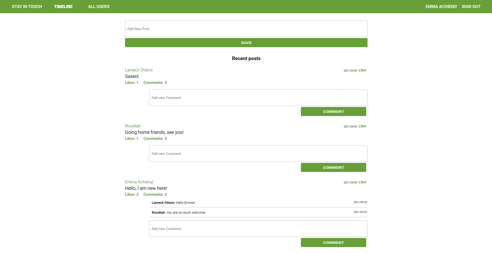

# Scaffold for social media app with Ruby on Rails

## Table of Contents

- [About the Project](#about-the-project)
- [Built With](#built-with)
- [Getting Started](#getting-started)
- [Prerequisites](#prerequisites)
- [API Documentation](#api-documentation)
- [Contributing](#contributing)
- [Author](#author)
- [Acknowledgements](#acknowledgements)

## About Project

This project builds on an existing project forked at [microverseinc](https://github.com/microverseinc/ror-social-scaffold). It a small scale social media project where users have the ability to send and receive friend requests, write post and comment on post. A user can choose to Accept or Reject a friend request and can also cancel a friend request sent.

This project also includes API feature for interacting with certain endpoints



## ## [Live Demo](https://ror-social-scaffold.herokuapp.com/)

## Built With

- Ruby v2.7.2
- Rails 6.1.2
- Postgresql

## Getting Started

- Clone this repo https://github.com/Lameck1/ror-social-scaffold
  ```
  git clone https://github.com/Lameck1/ror-social-scaffold.git
  ```
- Navigate to private-events folder
  ```
  cd ror-social-scaffold
  ```
- On the terminal, while in the 'ror-social-scaffold' directory, run the following to install dependency:
  ```
  bundle install
  ```
- At this point, you still don't have the Postgress database. Run the following to get setup:

  - Ensure that postgresql service is up and runnning
    `sudo service postgresql start`
  - Create the database
    `rails db:create`

  - Migrate the database
    `rails db:migrate`

- To interact with the project, run:

  ```
  rails server
  ```

  OR

  ```
  rails s
  ```

- Go to the browser and enter
  `http://localhost:3000`

### Prerequisites

- Ensure you have these installed:

  - Git
  - Ruby 2.7.2
  - Ruby on rails `gem install rails`

- You also need to ensure your yarn is upto date
  ```
  yarn install --check-files
  ```

### API Documentation

- In order to use the API feature of this application you must be a logged in user

- To get your `auth_token` visit your profile page by clicking your name on the Navbar

- All API requests must have the `auth_token` attached to the url endpoints eg:

```
http://localhost:3000/api/v1/posts/1/comments?auth_token=:your_auth_token_here
```

- This project supports API interactions using the following endpoints:

- GET `/api/v1/posts` for getting the list of posts

```
http://localhost:3000/api/v1/posts?auth_token=:your_auth_token_here
```

- GET `/api/v1/posts/:post_id/comments` for getting list of comments on a post

```
http://localhost:3000/api/v1/posts/:post_id/comments?auth_token=:your_auth_token_here
```

- POST `/api/v1/posts/:post_id/comments` for posting a comment to a post

```
http://localhost:3000/api/v1/posts/:post_id/comments?auth_token=:your_auth_token_here
```

Example Request body

```json
{
  "comment": {
    "content": "Comment body here!!"
  }
}
```

## Contributing

Contributions, issues, and feature requests are welcome!

Feel free to check the [issues page](https://github.com/Lameck1/ror-social-scaffold/issues).

## Authors

👤 **Lameck Otieno**

- GitHub: [@githubhandle](https://github.com/Lameck1)
- Twitter: [@twitterhandle](https://twitter.com/lameck721)
- LinkedIn: [LinkedIn](https://www.linkedin.com/in/lameck-odhiambo-642b7077/)

👤 **Teddy-Livingstone Ememandu**

- [Github](https://github.com/TedLivist)
- [Linkedin](https://www.linkedin.com/in/tememandu)

## Acknowledgements

Credits go to the following for providing guides on Ruby on Rails Association

- [**Rails Guides**](https://guides.rubyonrails.org/association_basics.html)

## Show your support

Give a ⭐️ if you like this project!
